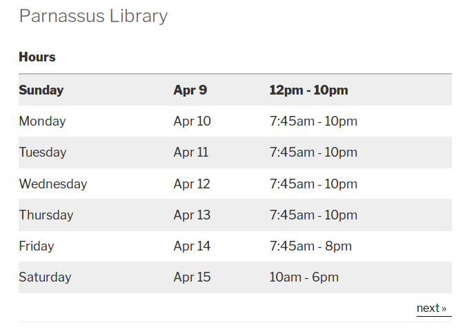
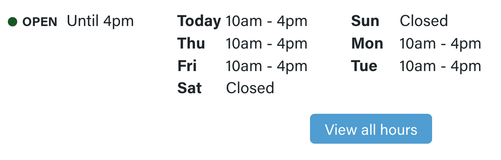
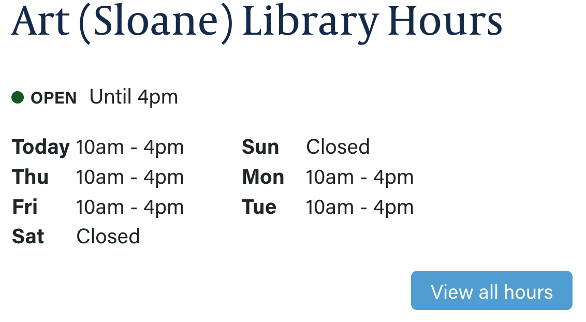
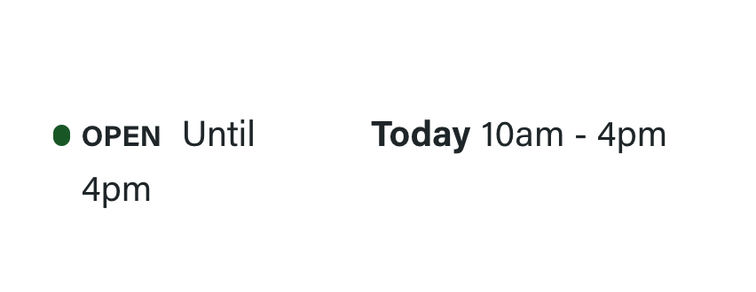
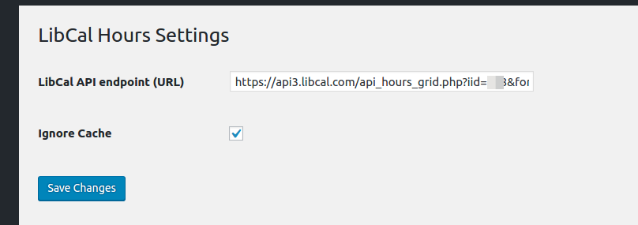
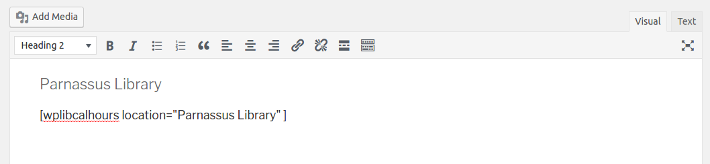

# LibCal Hours for WordPress

Embed opening hours for any given location from LibCal into WordPress via short codes.

### Table View


### Grid View


### Stacked View


### Today Only View


## Installation

Since this plugin is not available for automatic installation, please follow these [Manual Plugin Installation](https://codex.wordpress.org/Managing_Plugins#Manual_Plugin_Installation) steps.

## Configuration




In the plugin's Admin Settings form, enter the LibCal Hours API Endpoint URL and save the form.

Instructions on how to get that URL can be found on this [Wiki page](https://github.com/ucsf-ckm/wplibcalhours/wiki/How-to-get-the-LibCal-Hours-API-Endpoint-URL).

## Usage



Embed the `[wplibcalhours]` short code into your posts and pages.

The short code has the following configuration options.

- `location` ... The name of the location that you want to display opening hours for. *(mandatory)*
- `display_type` ... The layout of hours information. Options are `table`, `grid` and `stacked`. Defaults to `grid`. *(optional)*
- `num_weeks` ... The number of weeks of opening hours to display. Accepted values are `1`, `2` and `3`. Defaults to `3`. *(optional)*
- `today_only` ... Show hours for the current day only. Note if this is set to `true` it supersedes the `num_week` option. Defaults to `false`. *(optional)*

### Examples

`[wplibcalhours location="Parnassus Library"]` - This will print the opening hours for the "Parnassus Library" location for the next three weeks (starting today).

`[wplibcalhours location="Parnassus Library" num_weeks=1]` - Prints the opening hours for the "Parnassus Library" for the next week (starting today).

`[wplibcalhours location="Art (Sloane) Library" display_type="grid"]` - Prints the opening hours for the "Art" in a grid layout (starting today).

`[wplibcalhours location="Art (Sloane) Library" display_type="stacked"]` - Prints the opening hours for the "Art Library" in a stacked layout (starting today).

`[wplibcalhours location="Art (Sloane) Library" today_only=true]` - Prints the opening hours for the "Art Library" for today.

## API

This plugin also exposes opening hours via a read-only, public API endpoint. 

Requesting the path `/wp-admin/admin-ajax.php?action=wplibcalhours` on your site will yield
a JSON-formatted payload comprised of dates and opening hours, keyed by their location names.

These lists are sorted in chronological order and contain day-of-the-week, date and the day's opening hours information.

Each list starts with the current date.

#### Example payload

Three locations, the current date is January 3rd.

```javascript
{
  "Parnassus Library": [
    {
      "day": "Wed",
      "date": "Jan 3",
      "text": "7:45am - 10pm"
    },
    {
      "day": "Thu",
      "date": "Jan 4",
      "text": "7:45am - 10pm"
    }
    /* ... */
  ],
  "Mission Bay Library": [
    {
      "day": "Wed",
      "date": "Jan 3",
      "text": "9am - 6pm"
    },
    {
      "day": "Thu",
      "date": "Jan 4",
      "text": "9am - 6pm"
    }
    /* ... */
  ],
  "Mission Bay Hub": [
    {
      "day": "Wed",
      "date": "Jan 3",
      "text": "24 hours"
    },
    {
      "day": "Thu",
      "date": "Jan 4",
      "text": "24 hours"
    }
    /* ... */
  ]
}
```

## Styling

Please see this [Wiki page](https://github.com/ucsf-ckm/wplibcalhours/wiki/Styling-The-Output) for ideas on how to customize the styles of this plugin's generated markup.

## Attribution

This plugin was created using [WordPress Plugin Boilerplate](https://github.com/DevinVinson/WordPress-Plugin-Boilerplate).

## Copyright and License

Copyright (c) 2017 The Regents of the University of California

This is Open Source Software, published under the MIT license.
